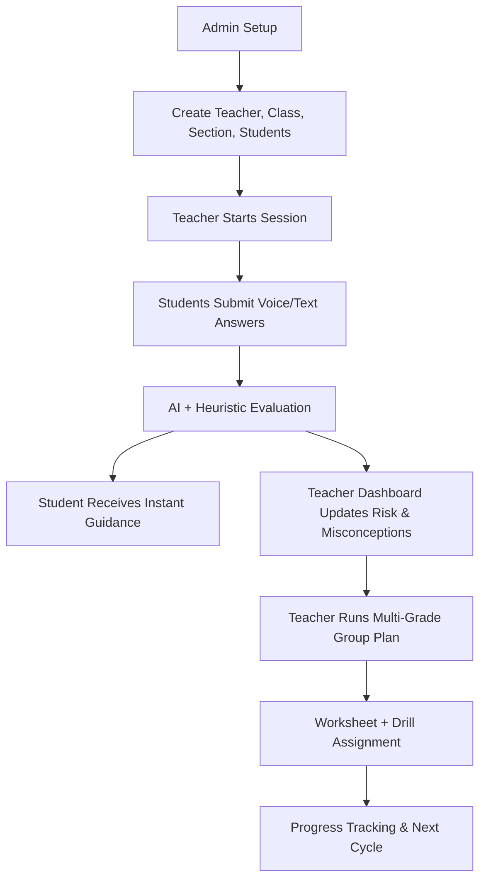
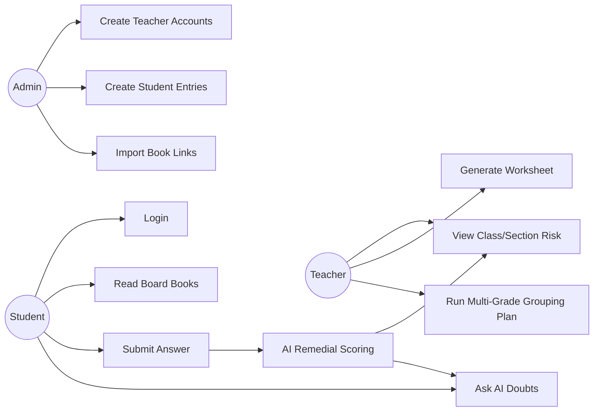
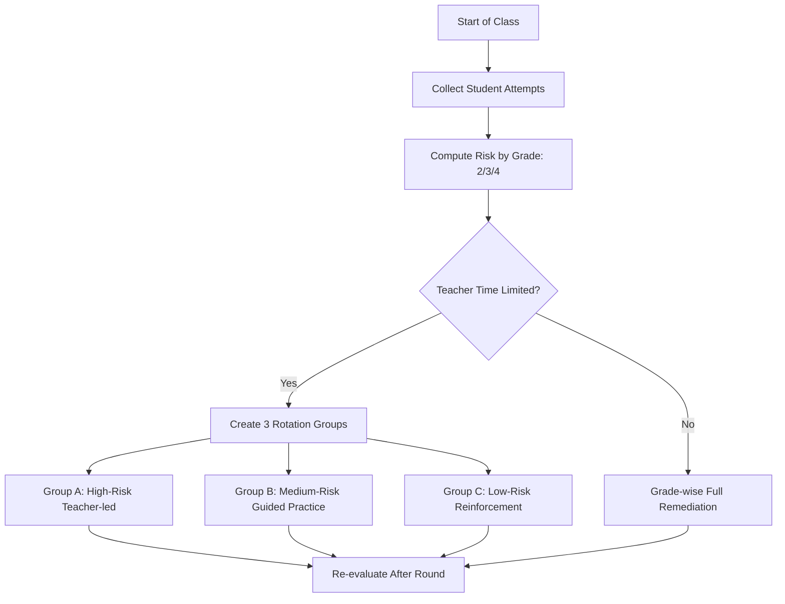

# 3. Process Flow / Use-Case Diagram

## 3.1 End-to-End Process Flow

```mermaid
flowchart TD
  A[Admin Setup] --> B[Create Teacher, Class, Section, Students]
  B --> C[Teacher Starts Session]
  C --> D[Students Submit Voice/Text Answers]
  D --> E[AI + Heuristic Evaluation]
  E --> F[Student Receives Instant Guidance]
  E --> G[Teacher Dashboard Updates Risk & Misconceptions]
  G --> H[Teacher Runs Multi-Grade Group Plan]
  H --> I[Worksheet + Drill Assignment]
  I --> J[Progress Tracking & Next Cycle]
```

## 3.2 Use-Case Diagram (Role View)

```mermaid
flowchart LR
  Admin((Admin)) --> A1[Create Teacher Accounts]
  Admin --> A2[Create Student Entries]
  Admin --> A3[Import Book Links]

  Teacher((Teacher)) --> T1[View Class/Section Risk]
  Teacher --> T2[Generate Worksheet]
  Teacher --> T3[Run Multi-Grade Grouping Plan]

  Student((Student)) --> S1[Login]
  Student --> S2[Read Board Books]
  Student --> S3[Submit Answer]
  Student --> S4[Ask AI Doubts]

  S3 --> E1[AI Remedial Scoring]
  E1 --> T1
  E1 --> S4
```

## 3.3 Multi-Grade Classroom Flow (One Teacher, Three Classes)

```mermaid
flowchart TD
  X[Start of Class] --> Y[Collect Student Attempts]
  Y --> Z[Compute Risk by Grade: 2/3/4]
  Z --> P{Teacher Time Limited?}
  P -->|Yes| Q[Create 3 Rotation Groups]
  Q --> Q1[Group A: High-Risk Teacher-led]
  Q --> Q2[Group B: Medium-Risk Guided Practice]
  Q --> Q3[Group C: Low-Risk Reinforcement]
  P -->|No| R[Grade-wise Full Remediation]
  Q1 --> S[Re-evaluate After Round]
  Q2 --> S
  Q3 --> S
  R --> S
```
