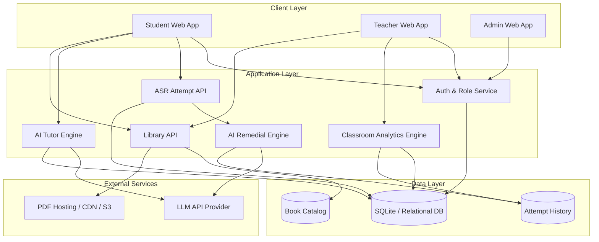

# 4. Architecture Diagram of the Proposed Solution

## 4.1 Logical Architecture

## 4.2 Key Architectural Characteristics

- Modular API services for auth, attempts, AI, analytics, and library
- Graceful fallback from AI to heuristic evaluation
- Works with hosted PDFs or local storage
- Supports role-aware UI and data access control

## 4.3 Security & Privacy Notes

- Token-based role access (`admin`, `teacher`, `student`)
- Student data isolation in endpoints
- API key kept server-side via environment variables
